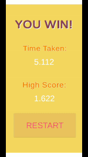

# Ball Bounce Game
An Android app that tests your reflexes with the objective of popping objects as quickly as possible.

### Features:
* Two difficulty modes: easy and hard
* Ability to restart after every win
* Objects are spawned in random with each run for longer replayability
* High scores are updated and saved locally
* High scores can be reset in the options menu

## 1. Test your reflexes by hitting circles as quickly as possible, and beat your high score!

## 2. Challenge yourself by playing a harder difficulty!

## 3. Reset your highscores and compete with friends!

Technologies Used
------
* C#
* Unity
